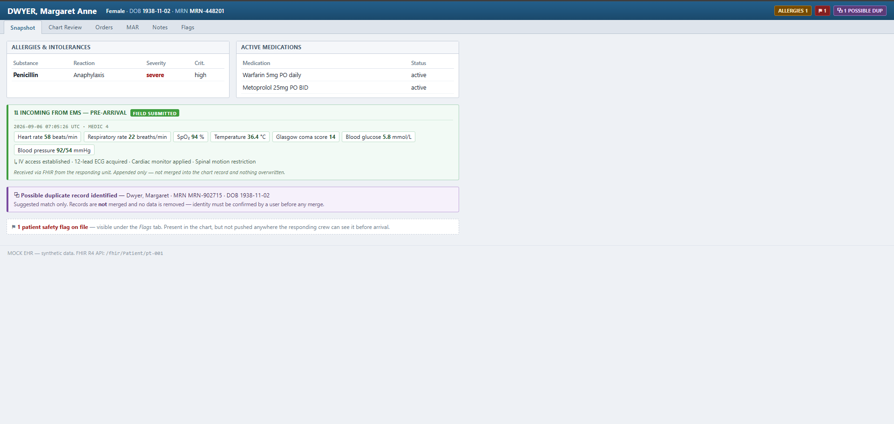
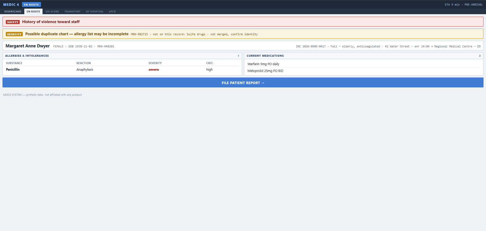
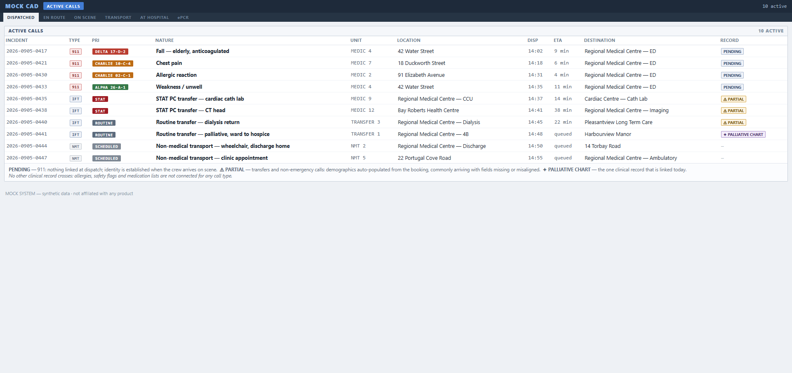
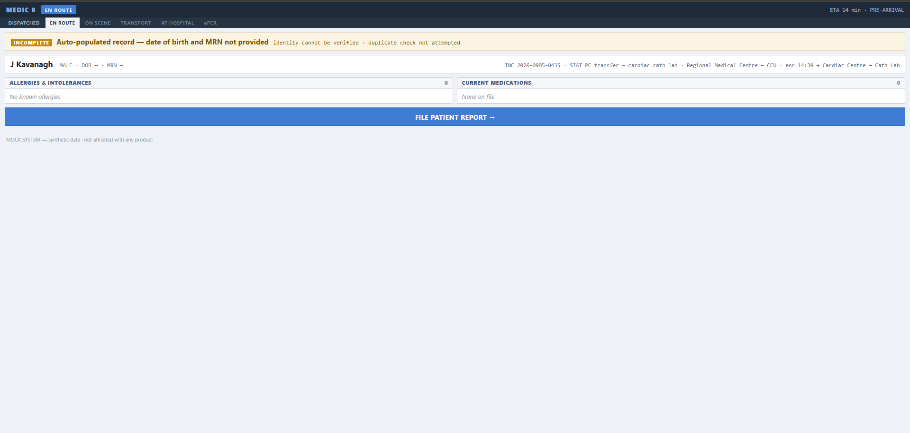
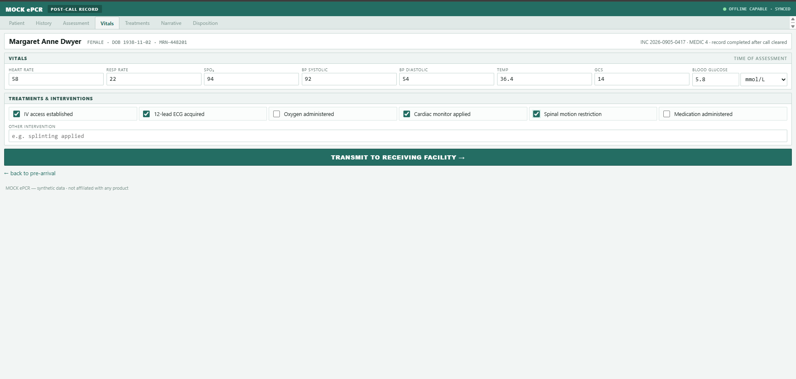
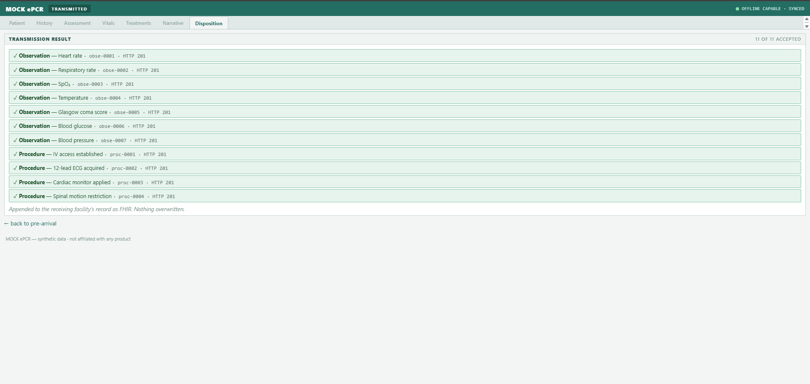

# Epic Done Right — a pre-arrival handoff bridge (FHIR R4)

A small, working demonstration of the EMS↔hospital data handoff that most
real deployments still don't close: pushing the hospital's existing patient
safety information **out to the crew before they arrive**, instead of leaving
it trapped in the EHR.

Built as a learning/portfolio project against synthetic data only. It mirrors
the core loop of commercial products like ESO Health Data Exchange — not to
replace them, but to prove the integration pattern end to end.

## The problem it demonstrates
At handoff, two failures happen constantly:
1. **Allergy specificity is lost.** The hospital knows "Penicillin — anaphylaxis
   (high criticality)." The crew record often shows only "PCN allergy."
2. **Safety flags don't reach the crew in time.** The EHR carries a documented
   violence-toward-staff flag. The crew finds out on arrival, not before.

3. **Split charts hide safety data.** The same human registered twice means the
   crew reading one chart sees half the allergy list — and never knows it.

All three are already *in the hospital system*. The gap is delivery, not data.

### What's already connected in the service I work in
A cross-vendor demographic integration already exists and runs every day. It just doesn't
involve the EHR:

```
transfer booking  ──▶  iNetCAD  ──▶  Siren ePCR    demographics, partial
palliative chart  ──▶  iNetCAD                     the ONE clinical record that links
Epic              ──╳                              nothing, either direction
```

On transfers and other non-emergency calls the patient is already known, so demographics flow
down that chain — arriving often enough with fields missing or misaligned that crews treat them
with caution. On a **911 call**, where the patient is unknown, the clock is running, and the
hospital is sitting on the allergy severity and the safety flag, **nothing crosses at all**;
identity is established when the crew reaches the patient.

And there is exactly **one clinical record that does link**: if a patient is palliative, the CAD
is configured to pull their palliative care chart. That's the whole list. One record type, one
population. Allergies, safety flags and medication lists don't cross for anyone.

That single working link is the most useful fact in this document, because it dismantles the
"integration is hard" objection by itself. The connection has already been built once, on
purpose, and it works. What's missing isn't capability — it's a decision about which records
are worth connecting.

Two things follow, and together they're why *"why would it help"* is the wrong question:

1. **This organisation already builds and operates cross-vendor integrations.** The pattern,
   the vendor relationships and the appetite are demonstrably there. The clinically richest
   source simply isn't on the network.
2. **The data flows where it's least needed.** Transfers are scheduled, the patient is known,
   and there is time. 911 is unknown, unscheduled and time-critical — and that's the one with
   no path.

The screenshots below reflect that split. **PENDING** and **⚠ PARTIAL** are roughly today's
reality; the pre-arrival card that follows them is what this bridge would add, and does not
exist today.


## Screens

### The argument, in two images
Same patient, same moment. The hospital has held this data the whole time.

**Hospital chart (EHR side)** — the violence-toward-staff flag is a 12-pixel `⚑ 1` chip in the
banner, its detail behind the *Flags* tab:



**Pre-arrival, en route (crew side)** — the same flag is the first thing on the screen, before
they reach the patient. Below it, a duplicate-chart warning notes an allergy that isn't on this
record at all:



### The call, screen by screen

**Dispatched — active calls**, showing what links today. **PENDING** — 911, nothing available
until the crew reaches the patient. **⚠ PARTIAL** — transfers, demographics auto-populated from
the booking, commonly with fields missing or misaligned. **✦ PALLIATIVE CHART** — the single
clinical record that is actually connected:



**The bridge declining to guess.** A STAT transfer whose auto-populated record arrived without a
date of birth or MRN. Rather than render a confident-looking blank, the card names what is
missing — and because identity can't be established, **the duplicate check is not attempted at
all**. There is a test asserting exactly this silence:



**ePCR — record completion, filed after the call is cleared:**



**Transmitted — the return path.** Vitals become LOINC-coded `Observation`s (blood pressure as a
single panel with two components), interventions become `Procedure`s, each appended with a
server-assigned id — nothing merged, nothing overwritten:



## Prior art — what already exists, and what doesn't
This isn't a novel idea, and novelty isn't the point: the point is demonstrating the
integration pattern end to end. What's actually on the market:

- **ESO Health Data Exchange** — the commercial product this project mirrors.
- **Siren Notification Board** (Medusa Medical, now an ESO product) — a web board that
  alerts a receiving facility in real time to inbound patients, colour-coded by priority.

Both are strongest in the **EMS → hospital** direction: *the crew is coming, here's what
we have.* That direction is commercially solved.

The direction this project leads with is the other one — **hospital → EMS, before
arrival.** The allergy specificity and the safety flag the hospital *already holds*,
pushed out to the crew while they're still en route. Even with a notification board fully
deployed, the crew still doesn't learn about the anaphylaxis or the violence-toward-staff
flag until they walk through the door.

One more thing worth saying plainly: this capability frequently exists in products a
service already licenses and simply isn't switched on. When that's the case the obstacle
isn't technical — it's that the seam between two organisations has no owner and no budget
line. The person who'd approve it carries all the downside risk and none of the credit.

## Identity: flagged, never resolved
Patient matching is the genuinely hard problem in EMS↔hospital exchange, and it is
**deliberately not solved here**. The bridge searches for other charts with the same
family name *and* birth date, and if it finds one it reports:

> ⚠ POSSIBLE DUPLICATE CHART — this patient may have 1 other chart on file.
> ↳ 1 allergy not on this record: Sulfa drugs
> *Not merged automatically — confirm identity with the patient or receiving facility.*

It never merges, never scores, never picks a winner. A wrong merge is unrecoverable
and the bridge is the worst-placed component in the system to make an identity call —
it has the least context of anyone in the chain. So it surfaces the ambiguity and
leaves the decision to a human, mirroring the "suggest, don't delete" behaviour of
mature EHRs rather than the last-write-wins pattern that silently discards data.

**This failure is already shipping.** On the system I use day to day, transfers and other
non-emergency calls **auto-populate patient demographics from the booking**, while 911 calls
don't — nobody knows who the patient is until contact. That auto-population is routinely
wrong, and the usual flavour isn't "wrong human": it's a field or two **missing or
misaligned**, so the crew starts from a record that *looks* populated but is incomplete.

That is this project's own thesis one layer over. Allergy specificity degrading between
hospital and crew; demographics degrading between booking and ePCR. The same data decay, at
the same kind of seam — one that no single system owns.

The demo reflects it rather than pretending otherwise. The call board marks 911 rows
**PENDING** (nothing available until the crew reaches the patient) and transfer rows
**⚠ PARTIAL** (auto-populated from the booking, commonly incomplete). Open the STAT transfer and the pre-arrival card states plainly
what didn't come across — and because there is no date of birth, **the bridge does not even
attempt a duplicate check**. Incomplete data in, honest degradation out, instead of a
confident-looking blank.

The demo also shows why it matters: `pt-001` carries *Penicillin / anaphylaxis*, its
duplicate `pt-004` carries *Sulfa / Stevens-Johnson*. A crew reading either chart
alone gets half the picture.

**Known trade-off:** detection costs up to three extra searches per candidate chart,
so it is measurably slower against a real server. Capped at three candidates. A
production version would push this to a proper MPI rather than doing it in the bridge.

## Architecture
```
  hospital/   Mock hospital (the "Epic" side)
              Serves synthetic patients as FHIR R4 resources over HTTP.
                :8001  /fhir/Patient/<id>, /fhir/AllergyIntolerance?patient=<id>,
                       /fhir/Flag?patient=<id>, /fhir/MedicationRequest?patient=<id>
                       part 3: /fhir/Encounter, /fhir/Condition, /fhir/MedicationAdministration

  bridge/     The transform layer (the part that matters).
              FHIR resources in -> flat crew "pre-arrival card" out.
              Preserves allergy specificity; promotes safety Flags to top level.

  epcr/       Mock field system (the EMS side), modelled as three moments in one call:
                :8002  /                       CAD  — active call list      [DISPATCHED]
                       /dispatch/<id>          mobile — pre-arrival card    [EN ROUTE]
                       /dispatch/<id>/report   ePCR  — record completion    [ePCR, post-call]
                       part 3: /fhir/Composition, /fhir/Provenance, /fhir/Practitioner (read-only)

  data/       patients.json    hospital's own records (FHIR-shaped, synthetic)
              calls.json       CAD/call context — EMS side only
              submissions.json append-only store of what the crew pushed back
              outcomes.json    part 3 — hospital visits, diagnoses, treatments (scenario data)
              epcr_reports.json part 3 — completed reports: attendants, signatures, field impression
```

Inbound:  **hospital → bridge → ePCR** (pre-arrival card)
Outbound: **ePCR → bridge → hospital** (`Observation` + `Procedure`)

## One call, three moments
Real field software splits this across modules — dispatch, in-field mobile, records —
and they are used at **different points in the call**. Collapsing them into one screen
is what makes a demo read wrong to anyone who has actually run a call, so the EMS side
is staged:

| Screen | When | What it does |
|---|---|---|
| **Active calls** | dispatched | incident #, MPDS determinant, priority, unit, destination |
| **Pre-arrival** | **en route** | the hospital's safety data arrives — *inbound payoff* |
| **ePCR** | **after the call is cleared** | vitals + interventions filed → *outbound payoff* |

A stage bar (`DISPATCHED → EN ROUTE → ON SCENE → TRANSPORT → AT HOSPITAL → ePCR`) runs
across the top of each so the sequence is legible at a glance. It matters because the
two integrations fire at opposite ends of the call: the pull happens *before* the crew
reaches the patient, the push happens *after* they have left the hospital.

Note the data separation: CAD context lives in `calls.json` on the EMS side. The
hospital has no idea which unit is responding or what the determinant was — it
shouldn't, and `patients.json` never carries it.

## The return path (ePCR → hospital)
The other half of a real bridge. The crew fills in vitals and interventions at
`/dispatch/<id>/report`; `transform_to_fhir()` — the mirror of `transform_to_card()` —
turns that flat form into proper FHIR and POSTs it back:

| Crew enters | Becomes |
|---|---|
| HR 118 | `Observation` · LOINC `8867-4` · `118 /min` |
| SpO₂ 94 | `Observation` · LOINC `59408-5` · `94 %` |
| BP 88/54 | **one** `Observation` · LOINC `85354-9` with components `8480-6` / `8462-4` |
| "IV access established" | `Procedure` · status `completed` · performer MEDIC 4 |

Blood pressure is modelled the way the spec actually calls for — a single panel
Observation with two components, not two separate Observations.

The outbound transform emits **fully coded** CodeableConcepts (`coding` *and* `text`).
Pushing bare text back would recreate, in the opposite direction, the exact
specificity loss this project exists to fix on the way in. LOINC codes are real;
interventions are deliberately left text-coded rather than inventing SNOMED codes
that couldn't be verified — a production version needs a real terminology binding.

**Append-only, by design.** Submissions land in a separate `data/submissions.json`
and are given server-assigned ids and `meta.source = "#epcr-field-submission"`.
Crew data never mutates the hospital's own record, nothing is overwritten and
nothing is merged — same stance as the duplicate flagging. Read it back with:

```bash
curl "localhost:8001/fhir/Observation?patient=pt-001"
curl "localhost:8001/fhir/Procedure?patient=pt-001"
```

## Run it

### Docker (recommended)
```bash
docker compose up --build
```
- hospital → <http://localhost:8001>  (EHR chart view at `/chart/pt-001`)
- EMS side → <http://localhost:8002>  ← **start here**

Two services off one image. The ePCR reaches the hospital by **service name**
(`FHIR_BASE=http://hospital:8001/fhir`), which is the same single knob you'd turn to
point the bridge at a real FHIR server. Runs as a non-root user; the hospital gets the
data volume read-write (it receives crew submissions), the crew side gets it read-only.

### Without Docker
```bash
python -m venv .venv && ./.venv/bin/pip install -r requirements.txt
./run.sh                      # starts both, Ctrl-C stops both
```

Then open **<http://localhost:8002>** and pick a call. `pt-001` (Dwyer) is the one that
shows the severe allergy, the safety flag, *and* a possible duplicate chart. From the
pre-arrival card, **FILE PATIENT REPORT** exercises the return path.

Worth viewing side by side: the hospital's own chart at
**<http://localhost:8001/chart/pt-001>** carries the same safety flag as a small chip
behind a tab — it's the first thing on the screen in the truck.

Environment:

| var | default | notes |
|---|---|---|
| `FHIR_BASE` | `http://localhost:8001/fhir` | point the bridge anywhere R4 |
| `HOST` | `127.0.0.1` | `0.0.0.0` to expose on a LAN |
| `DEBUG` | off | `1` enables the Flask debugger — never in a deployment |

Test the transform alone, no services, no browser:
```bash
python bridge/bridge.py pt-001
FHIR_BASE=https://hapi.fhir.org/baseR4 python bridge/bridge.py 137206160
```

## Scenario data for part 3
[The next project in this series](https://github.com/Fletcher14/patient-lookup-portal) gets the
hospital outcome back to the paramedic who ran the call. It needs things this demo never modelled: hospital visits with diagnoses and treatments
(`data/outcomes.json`), and completed reports carrying attendants, licenses, signatures and a
field impression (`data/epcr_reports.json`). Both were added **without changing anything that
already worked**:

- `patients.json` and `calls.json` are untouched. Scenario patients are reachable by id and by
  search, but not listed in the hospital index that other tools rely on.
- No scenario patient shares a family name and birth date with an existing one, so the
  pre-arrival duplicate flag can't fire falsely on the existing board.
- `GET /fhir/Procedure?patient=` still returns only field submissions. Hospital procedures come
  back only when you ask by visit, with `?encounter=`.
- The ePCR screens are unchanged; the reports are served as read-only FHIR. Who attended and who
  signed live in `Provenance`, one per report version — an amendment is a new version, never an edit.

Every record is there to pose a specific problem — each is labelled in the data file's
`_scenarios` / `_scenario` fields.

## FHIR resources used
`Patient`, `AllergyIntolerance`, `Flag`, `MedicationRequest` — all R4. For part 3's scenario
data, also `Encounter`, `Condition`, `MedicationAdministration`, `Composition`, `Provenance` and
`Practitioner`.

## Hardened against a real FHIR server
The bridge is server-agnostic — point it anywhere with an env var:

```bash
FHIR_BASE=https://hapi.fhir.org/baseR4 python bridge/bridge.py 137206160
```

It was run against the public HAPI test server, and **three real failure classes
surfaced that synthetic data never would have**:

| Found | Why it broke | Fix |
|---|---|---|
| `KeyError: medicationCodeableConcept` | `medication[x]` is a FHIR **choice type** — a `MedicationRequest` carries either `medicationCodeableConcept` *or* `medicationReference` | handle both forms |
| Allergies silently became `"unknown"` | `CodeableConcept.text` is **optional**; real records often carry only `coding[].display`. Defaulting to `"unknown"` destroyed the exact specificity this project exists to preserve | fall back `text → coding.display → coding.code` |
| `HTTPError 410 Gone` | Real servers expire and delete resources | raise `PatientNotFound`, return a clean 404 |

Also: one failing search (e.g. `Flag`) no longer takes the whole card down — the
crew keeps their allergy list even if another resource type is unavailable.

## SMART on FHIR — Backend Services

Real Epic access is gated on SMART, so an integration without it isn't deployable no
matter how good the transform is. This implements the **Backend Services** profile.

**Why that profile and not the other one** — this is the part worth getting right.
SMART has two flavours, and they're for different situations:

| | App Launch | **Backend Services** |
|---|---|---|
| Who initiates | a clinician clicks the app inside the EHR | a system, unattended |
| Credential | authorization code + user session | **asymmetric signed JWT** |
| Scopes | `patient/*`, `user/*` | `system/*` |

Nobody clicks anything here: a unit is dispatched at 3am and the bridge pulls on its own.
That makes this unambiguously Backend Services, and choosing App Launch would be the
common way to get SMART wrong.

```
private key ──▶ signed JWT assertion (RS384, kid) ──▶ POST client_credentials
             ──▶ short-lived access token ──▶ Authorization: Bearer on FHIR calls
```

The private key never leaves the machine. The server holds only the public JWKS, and each
request carries a JWT signed with the private half — there is no shared secret to leak.

```bash
pip install -r requirements-smart.txt
python bridge/smart_register.py                    # keypair + JWKS + register with the sandbox
set -a && . secrets/smart.env && set +a
python bridge/smart_check.py                       # acquire a token
```

**Verified against the SMART reference sandbox**, and the negative case is the one that
proves the crypto is real rather than rubber-stamped:

```
correct key (registered)      →  access token issued, expires_in 300
wrong key (never registered)  →  400 invalid_grant
                                 "Unable to verify the token with any of the public keys found in..."
```

**Honest limitation:** that sandbox serves its FHIR endpoints in open mode, so the token
isn't what gates reads there — an unauthenticated `$export` also returns 202. What is
demonstrated is the **credential exchange**, which is exactly the part Epic gates. Proving
enforcement end to end needs a server that actually refuses anonymous reads.

**Auth is optional and off by default.** With no `SMART_*` environment set the bridge behaves
exactly as before, so `docker compose up` and the HAPI examples keep working for anyone who
clones this. `secrets/` is gitignored.

## Tests
```bash
pip install -r requirements-dev.txt
python -m pytest tests/ -q
```
Transform-level and pure — dicts in, dicts out, no network, no running services.
They assert the contract the project actually promises: allergy specificity survives,
safety flags get promoted, *inactive* flags don't alarm the crew, duplicates are
flagged but never resolved, and none of the real-world shapes above crash it.

`tests/test_part3_mocks.py` covers the part 3 scenario data through Flask's test client (still no
network). It checks first that the original roster, the duplicate search, the field-submission
endpoint and the CAD board are exactly as they were, then that every reference in the new data
resolves and every code comes from the real FHIR value sets.

## Deliberately out of scope
- **Patient matching / MPI.** Flagged, never resolved — see *Identity* above.
- **Auth / OAuth2 / SMART-on-FHIR.** Real Epic access is gated on it; a local demo isn't.
- **Audit logging and consent.** Both are mandatory in production, neither is here.
- **A database.** JSON on disk is enough to show the pattern.
- **Terminology binding for interventions.** Text-coded on purpose (see above).

## Roadmap
- ~~Return path: an ePCR form that POSTs `Observation` + `Procedure` back.~~ **Done**
- ~~Point the bridge at a live FHIR server and handle real-world messiness.~~ **Done**
- ~~Package it so a stranger can run it.~~ **Done** — `docker compose up`
- ~~**SMART-on-FHIR** Backend Services auth.~~ **Done** — see *SMART on FHIR* above.
- ~~A patient continuity layer — many sources in, one canonical record out.~~ **Done** —
  [continuity-layer](https://github.com/Fletcher14/continuity-layer).
- ~~The return path to the clinician.~~ **Done** —
  [patient-lookup-portal](https://github.com/Fletcher14/patient-lookup-portal): the hospital outcome
  back to the paramedic who ran the call. Its scenario data lives here (see *Scenario data for part 3*).
```
